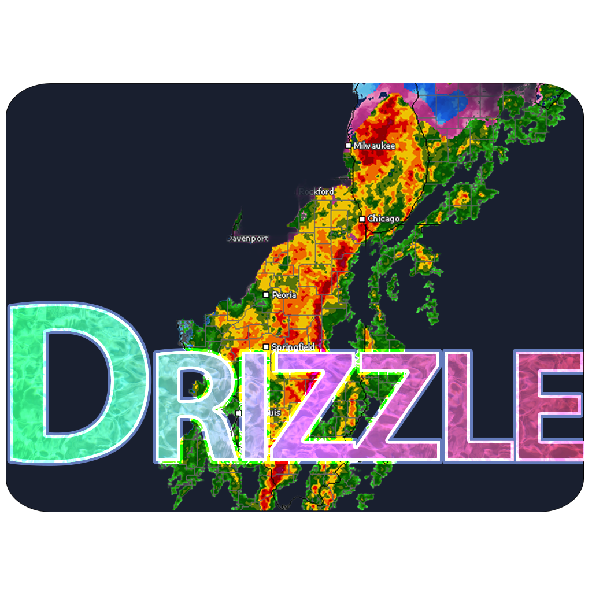
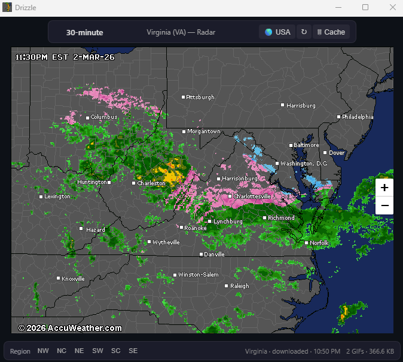
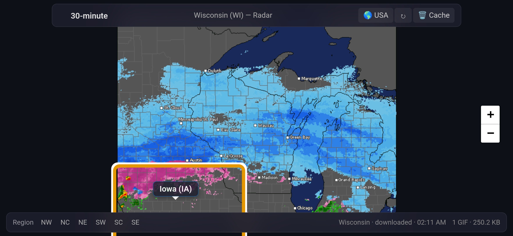

# Drizzle

The best*, smallest weather application ever made.

<p align="center">
  
</p>

A single ~171 KB `.exe` that shows live NEXRAD radar for the entire United States — national, regional, and state-level — with no installer, no frameworks, no Electron, and no apologies. Also available as a ~211 KB Android APK and a ~267 KB iOS app.


---

## Acknowledgments

Radar imagery is provided by [AccuWeather](https://www.accuweather.com) via their [Sirocco](https://sirocco.accuweather.com) public radar mosaic service. AccuWeather has made these animated NEXRAD composites freely available for decades — this project wouldn't exist without that generosity. Thank you, AccuWeather.

This project is not affiliated with, endorsed by, or sponsored by AccuWeather, Inc. All imagery and trademarks remain the property of their respective owners. Please respect AccuWeather's [Terms of Use](https://www.accuweather.com/en/legal).

---

## What It Does

Drizzle displays animated radar GIF mosaics.

- **Click any state** → loads that state's dedicated radar GIF
- **Click a region button** → loads a multi-state regional composite
- **Click 🌎 USA** → returns to the national radar mosaic
- Large states (California, Texas) are split into sub-regions with click-zone detection

There is no forecast, no temperature, no hourly breakdown. Just radar. That's it.

### Screenshots
<p align="center">
<p align="center"><strong>USA</strong></p>


<br />

<p align="center"><strong>State</strong></p>



<br />

<p align="center"><strong>Android</strong></p>


</p>

## Why

Most weather apps ship 100+ MB of runtime to show you a web page. Drizzle does the same thing in under 175 KB on Windows, under 215 KB on Android, and under 270 KB on iOS.

The goal: **how small and self-contained can a useful weather radar viewer be?**

---

## How It Works

| Layer | Technology |
|---|---|
| **Window** | Win32 `WNDCLASSW` + `CreateWindowExW` — no framework |
| **Rendering** | WebView2 (Edge/Chromium, already on Windows 10/11) |
| **Radar source** | AccuWeather `inmasir*.gif` animated mosaics (640×480) |
| **Map projection** | proj4js LCC → CRS.Simple pixel mapping in Leaflet |
| **State boundaries** | Embedded GeoJSON (CONUS only), projected to match each GIF |
| **Assets** | HTML + GeoJSON + icon compiled into the `.exe` as resources |
| **Downloads** | `URLDownloadToFileW` on background threads, cached to `radar/` |

### Radar Coverage

- **1 national** mosaic (full CONUS)
- **6 regional** composites (NE, NW, NC, SE, SW, SC) with per-region LCC calibrations
- **37 state** GIFs + **11 redirects** to neighboring state GIFs (48 CONUS states covered)
- **6 sub-state** splits (NorCal, CentralCal, SoCal, TX East/South/West)

---

## Building

**Prerequisites:** Visual Studio 2022 (or Build Tools) with C++ desktop workload.

```powershell
# One-step build (downloads WebView2 SDK automatically)
.\build.ps1
```

Or with CMake:

```powershell
nuget install Microsoft.Web.WebView2 -Version 1.0.3179.45 -OutputDirectory deps
cmake -B out/build/x64-Release -G Ninja -DCMAKE_BUILD_TYPE=Release
cmake --build out/build/x64-Release
```

Output is a single `Drizzle.exe` (~171 KB).

### Android

Built automatically via GitHub Actions. To build locally:

```sh
cd android
# Sync shared assets from Assets/
powershell ./sync-assets.ps1
gradle assembleRelease
```

Output is `app/build/outputs/apk/release/app-release.apk` (~211 KB).

### iOS

Built automatically via GitHub Actions. To build locally, requires a Mac with Xcode 16+.

```sh
# Copy the app icon (required before first build, file is gitignored)
cp Assets/1024.png ios/Drizzle/AppIcon.png

# Open in Xcode, set your team, and run
open ios/Drizzle.xcodeproj
```

App size on device: ~267 KB.

---

## Project Structure

```
Drizzle/
├── main.cpp              # Win32 host, WebView2 init, download threads
├── WeatherGlance.rc      # Resource script (icon, embedded HTML/JSON)
├── app.manifest          # DPI awareness, common controls
├── build.ps1             # One-step Windows build script
├── CMakeLists.txt
├── Assets/               # Shared across all platforms
│   ├── radar-map.html    # All UI, map, projection, and radar logic
│   ├── us-states.geo.json
│   ├── 1024.png          # iOS app icon (1024×1024, opaque)
│   ├── 1024a.png         # Android adaptive icon (1024×1024, transparent)
│   ├── radar.png         # Windows icon source (256×256)
│   └── radar.ico         # Windows icon (16/32/48/256)
├── android/              # Android WebView wrapper (Kotlin)
│   └── app/src/main/java/com/drizzle/app/MainActivity.kt
├── ios/                  # iOS WebView wrapper (Swift)
│   └── Drizzle/
│       ├── RadarViewController.swift
│       └── AppSchemeHandler.swift
└── .github/workflows/    # CI: builds APK + iOS archive on push
```

---

## License

MIT License — see [LICENSE](LICENSE).

This license applies to the source code in this repository only. Radar imagery accessed by the application is provided by AccuWeather, Inc. and is subject to their terms.
