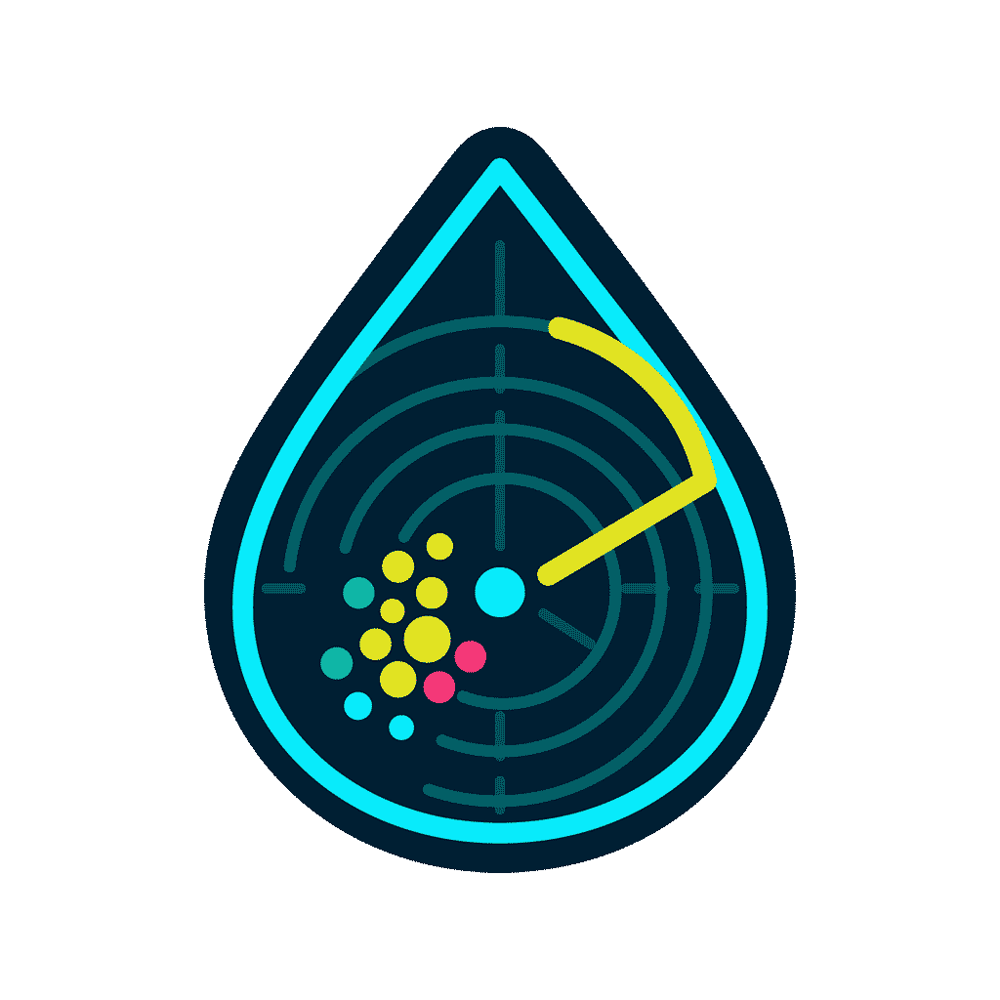
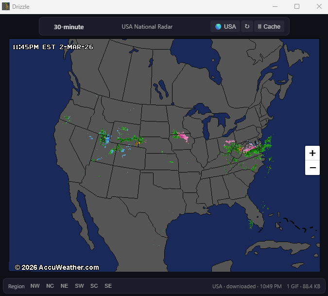
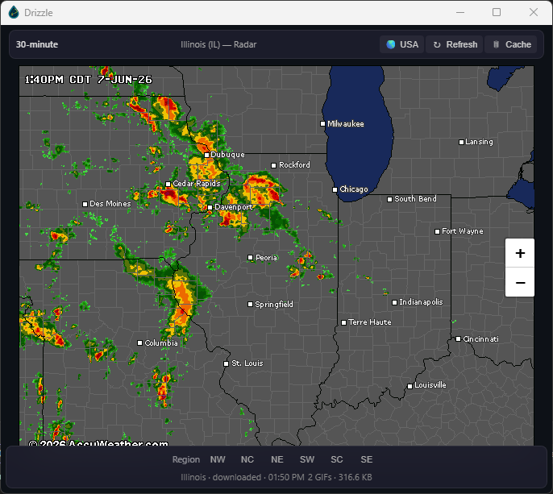
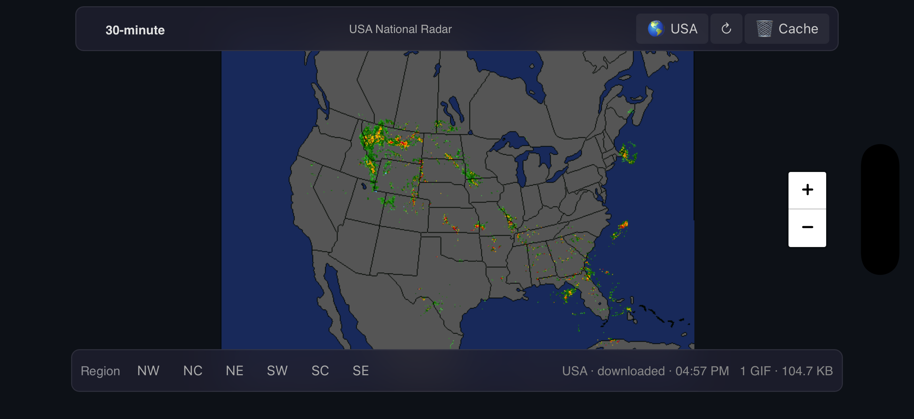
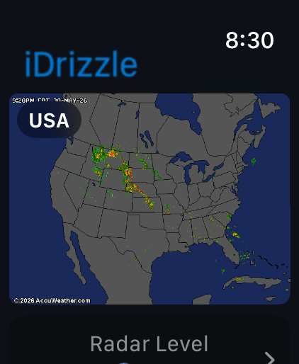

# Drizzle

The best*, smallest weather application ever made.

<p align="center">
  
</p>

Also available as a ~222 KB Android APK and a ~176 KB iOS download (~445 KB installed).


---

## Acknowledgments

Radar imagery is provided by [AccuWeather](https://www.accuweather.com) via their [Sirocco](https://sirocco.accuweather.com) public radar mosaic service. AccuWeather has made these animated NEXRAD composites freely available for decades — this project wouldn't exist without that generosity. Thank you, AccuWeather.

This project is not affiliated with, endorsed by, or sponsored by AccuWeather, Inc. All imagery and trademarks remain the property of their respective owners. Please respect AccuWeather's [Terms of Use](https://www.accuweather.com/en/legal).

---

## What It Does

Drizzle displays animated radar GIF mosaics.

- **Click any state** → loads that state's dedicated radar GIF
- **Click a region button** → loads a multi-state regional composite
- **Click 🌎 USA** → returns to the national radar mosaic
- Large states (California, Texas) are split into sub-regions with click-zone detection

There is no forecast, no temperature, no hourly breakdown. Just radar. That's it.

### Screenshots

<p align="center"><strong>Windows</strong>



</p>
<br />

<p align="center"><strong>Android</strong>


</p>
<br />

<p align="center"><strong>iOS / iPadOS (iDrizzle)</strong>


</p>
<br />

<p align="center"><strong>Apple Watch (iDrizzleWatch)</strong>


</p>

### Why

Most weather apps ship 100+ MB of runtime to show you a web page. Drizzle does the same thing in ~182 KB on Windows, ~222 KB on Android, ~176 KB download (~445 KB installed) on iOS, and ~700 KB on Apple Watch.

The goal: **how small and self-contained can a useful weather radar viewer be?**

---

## How It Works

| Layer | Technology |
|---|---|
| **Window** | Win32 `WNDCLASSW` + `CreateWindowExW` — no framework |
| **Rendering** | WebView2 (Edge/Chromium, already on Windows 10/11) |
| **Radar source** | AccuWeather `inmasir*.gif` animated mosaics (640×480) |
| **Map projection** | proj4js LCC → CRS.Simple pixel mapping in Leaflet |
| **State boundaries** | Embedded GeoJSON (CONUS only), projected to match each GIF |
| **Assets** | HTML + GeoJSON + icon compiled into the `.exe` as resources |
| **Downloads** | `URLDownloadToFileW` on background threads, cached to `radar/` |

### Radar Coverage

- **1 national** mosaic (full CONUS)
- **6 regional** composites (NE, NW, NC, SE, SW, SC) with per-region LCC calibrations
- **37 state** GIFs + **11 redirects** to neighboring state GIFs (48 CONUS states covered)
- **6 sub-state** splits (NorCal, CentralCal, SoCal, TX East/South/West)

---

## Building

**Prerequisites:** Visual Studio 2022+ (or Build Tools) with C++ desktop workload.

```powershell
# One-step build (downloads WebView2 SDK automatically)
.\build.ps1
```

Or with CMake:

```powershell
nuget install Microsoft.Web.WebView2 -Version 1.0.3179.45 -OutputDirectory deps
cmake -B out/build/x64-Release -G Ninja -DCMAKE_BUILD_TYPE=Release
cmake --build out/build/x64-Release
```

Output is a single `Drizzle.exe` (~182 KB, with embedded version metadata).

### Android

Built automatically via GitHub Actions. For Play Store release, use a signed **AAB**.

Local setup for store signing:

```sh
cd android
cp keystore.properties.template keystore.properties
# edit keystore.properties with your real keystore path + passwords

# Sync shared assets from Assets/
powershell ./sync-assets.ps1

# Build side-load APK + Play AAB
gradle assembleRelease bundleRelease
```

Outputs:
- `app/build/outputs/apk/release/Drizzle_v{version}.apk` (~222 KB)
- `app/build/outputs/bundle/release/Drizzle_v{version}.aab` (upload this to Play Console)

Play Console requirements (free app still needs these):
- App signing key (Play App Signing)
- App content forms (Data safety, content rating, ads, app access)
- Privacy policy URL ([docs/PRIVACY.md](docs/PRIVACY.md))
- Store listing assets (icon, screenshots, feature graphic)
- **Short promo/demo video captured from your phone while using the app** (recommended for listing quality)

### iOS / iPadOS / macOS (iDrizzle)

Built automatically via GitHub Actions. The iOS-family app is branded as **iDrizzle** (Android remains **Drizzle**). To build locally, requires a Mac with Xcode 26+ (App Store requires the iOS 26 SDK).

```sh
# Provide your Apple Developer Team ID for local signing (file is gitignored)
cp ios/Local.xcconfig.template ios/Local.xcconfig
# then edit ios/Local.xcconfig and set DRIZZLE_DEVELOPMENT_TEAM = <your 10-char Team ID>

# Open in Xcode and run iDrizzle
open ios/iDrizzle.xcodeproj
```

> Signing is sourced from `ios/Local.xcconfig`, which is gitignored so no personal
> Apple Team ID is committed. Leave it empty for simulator builds or CI.

App size on device: ~277 KB.

---

### Apple Watch (iDrizzleWatch)

The watchOS app target (`iDrizzleWatch Watch App`) lives in the same Xcode
project as iOS (`ios/iDrizzle.xcodeproj`) and is distributed as the iPhone app's
companion watch app (embedded watch content in the iOS archive). It mirrors the
same radar functionality natively in SwiftUI (watchOS has no `WKWebView`, so
radar GIFs are downloaded directly on-watch from the same AccuWeather endpoint
and animated with ImageIO).

```sh
# Reuses the same ios/Local.xcconfig Team ID as the iPhone app.
# Open the single project and run the watch target on an Apple Watch destination.
open ios/iDrizzle.xcodeproj
```

> `setup-ios-local.sh` prepares local signing config and opens the single project.

App size on device: ~699 KB. The watch build is larger than the iPhone app
because watchOS has no system `WKWebView`, so it bundles a native SwiftUI radar
renderer plus the `us-states.geo.json` projection/hit-mapping data and the
ImageIO GIF-animation stack — none of which the WebView-based platforms ship.

---

### Garmin Venu X1 / D2 Mach 2 (Connect IQ)

The Garmin target lives in [`garmin/`](garmin/) as a separate Connect IQ project
targeting the Venu X1 device id `venux1` and D2 Mach 2 device id `d2mach2`. It
mirrors the practical watchOS flow natively in Monkey C: direct AccuWeather radar
image requests, USA / region / state selection via native Garmin menu controls,
state redirect handling, scaled 640 x 480 radar image display, region fallback when a
state radar image is unavailable, and a five-minute in-memory radar cache.

Like the Windows `Drizzle.exe`, the Garmin artifacts are built locally with a
one-step script and shipped with the GitHub release (there is no Garmin CI job):

```powershell
pwsh garmin/build.ps1
```

This produces, in the git-ignored `garmin/bin/`:

- `Drizzle.iq` — Connect IQ Store bundle (all products)
- `DRZLX1.prg` — Venu X1 side-load
- `DRZLD2.prg` — D2 Mach 2 side-load

See [`garmin/README.md`](garmin/README.md) for SDK setup, the developer key, and the
device-definition license note. Attach the built `.iq`/`.prg` files to the release
alongside the `.exe`.

This first Garmin version is intentionally isolated from the existing Windows,
Android, and iOS build systems. It uses Garmin image requests with AccuWeather's
640 x 480 Sirocco GIF feed so radar imagery fits the supported watch screens.
Both Garmin targets have been compiler-verified with Connect IQ Compiler 9.1.0.

---

## Publishing to the App Store

iOS releases are automated with GitHub Actions
([`.github/workflows/ios-release.yml`](.github/workflows/ios-release.yml)). Pushing a
version tag (e.g. `git tag v2.3.0 && git push origin v2.3.0`) — or running the
**iOS Release** workflow manually from the Actions tab — archives and uploads one
iOS archive that includes the embedded watch app companion.

The watch app is still a separate watch target for local build/run/testing on
Apple Watch, but App Store distribution is delivered through the iOS upload.

Authentication uses an **App Store Connect API key** stored as encrypted GitHub
repository secrets — no certificates, profiles, or IDs live in the repo.

**See [`docs/PUBLISHING.md`](docs/PUBLISHING.md)** for the full guide: registering
bundle IDs, generating the API key, required GitHub secrets, and the App Store
Connect metadata checklist.

---

## Project Structure

```
Drizzle/
├── main.cpp              # Win32 host, WebView2 init, download threads
├── WeatherGlance.rc      # Resource script (icon, embedded HTML/JSON)
├── app.manifest          # DPI awareness, common controls
├── build.ps1             # One-step Windows build script
├── CMakeLists.txt
├── Assets/               # Shared across all platforms
│   ├── radar-map.html    # All UI, map, projection, and radar logic
│   ├── us-states.geo.json
│   ├── iDrizzle.png      # iOS app icon (1024×1024, opaque)
│   ├── 1024a.png         # Android adaptive icon (1024×1024, transparent)
│   ├── radar*.png        # Windows icon sources (256/48/32/16, pre-optimized)
│   └── radar.ico         # Windows icon (16/32/48/256, built by build_ico.py)
├── android/              # Android WebView wrapper (Kotlin)
│   └── app/src/main/java/com/drizzle/app/MainActivity.kt
├── ios/                  # iOS WebView wrapper (Swift)
│   ├── iDrizzle/
│   │   ├── RadarViewController.swift
│   │   └── AppSchemeHandler.swift
│   └── iDrizzleWatch Watch App/  # watchOS app target (native SwiftUI)
│       ├── RadarService.swift
│       ├── GIFImage.swift
│       └── ContentView.swift
├── garmin/               # Garmin Connect IQ target for Venu X1
│   ├── manifest.xml
│   ├── monkey.jungle
│   └── source/
└── .github/workflows/    # CI: builds Android and iOS/watch archive
```

---

## Size Optimization Notes

As of Visual Studio 2026 (MSVC 19.50+), the **static Universal CRT** (`libucrt.lib`) grew significantly — adding ~110 KB to any statically-linked exe compared to VS 2022. If you're chasing the smallest possible binary on Windows 10+:

- **Hybrid CRT linking**: compile with `/MT` (static VC runtime) but swap the static ucrt for the dynamic one: `/NODEFAULTLIB:libucrt.lib ucrt.lib`. This keeps `vcruntime` embedded (no redistributable needed) while using `ucrtbase.dll` that ships with every Windows 10+ install.
- Combined with `/O1 /GL` + `/LTCG /OPT:REF /OPT:ICF`, this now lands around ~182 KB with the current full-color embedded icon (still far below typical desktop app sizes).
- This is safe for any app that already targets Windows 10+ (e.g., anything using WebView2).

---

## License

MIT License — see [LICENSE](LICENSE).

This license applies to the source code in this repository only. Radar imagery accessed by the application is provided by AccuWeather, Inc. and is subject to their terms.
